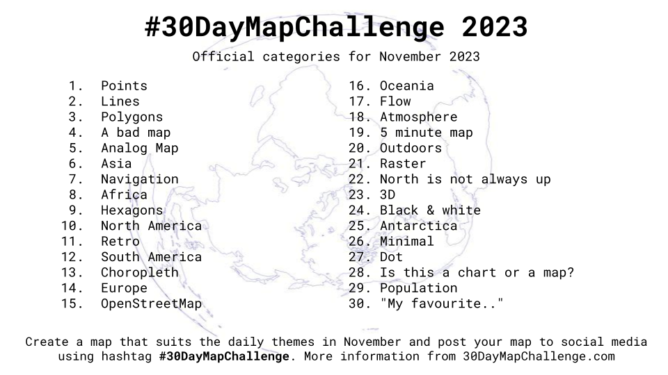
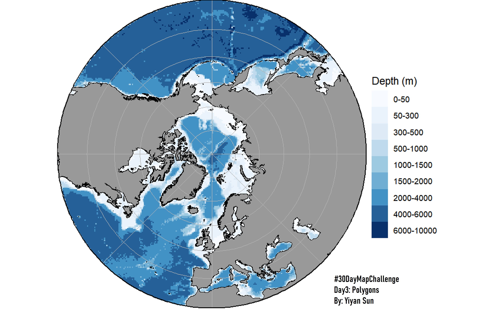
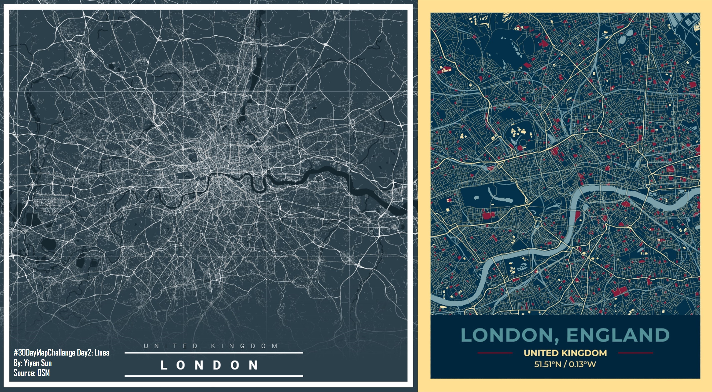
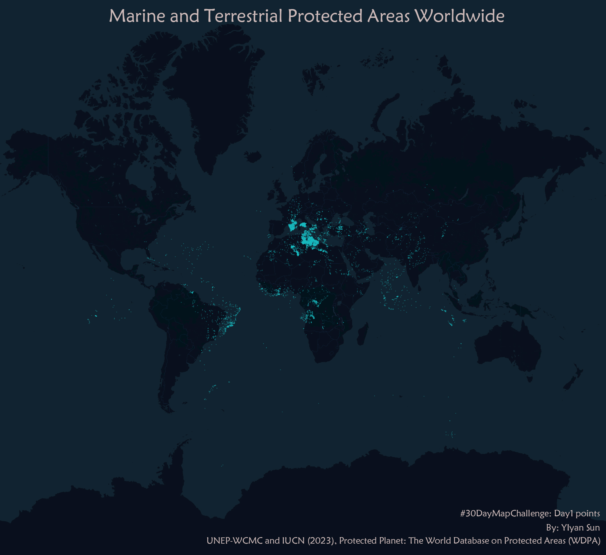

# 30DayMapChallenge
#30DayMapChallenge introduction here <https://30daymapchallenge.com/> 
<https://github.com/tjukanovt/30DayMapChallenge>

First time to participate in this November challenge, use more code, packages, and geospatial data viz tools to demonstrate maps.
## Day3:Polygons

Try to explore the simplicity and standardization of academic research cartography with R packages: ggOceanMaps and grfxtools.  
WGS 84 / Arctic Polar Stereographic (ArcticStereographic) Projection, EPSG 3995
## Day2:Lines

Today still use new online vis tools with OSM data - city maps of Greater London.
## Day1:Points

Marine and terrestrial protected areas worldwide with Kepler and Foursquare.
